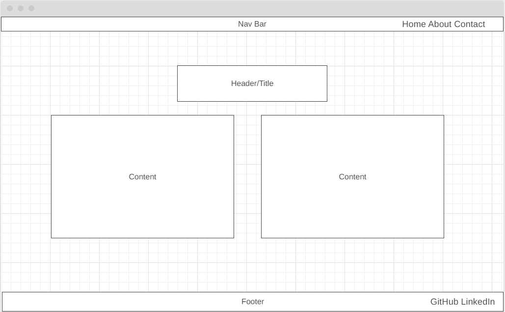

# Portfolio

## Technologies Used
<ul>
    <li>HTML</li>
    <li>JS</li>
    <li>CSS</li>
</ul>

## Installation Instrustions

 This Portfolio is just a website so there are no instructions for installation.

## User Stories
<ul>
    <li>As an employer, I want to gauge how well a candidate applies their knowledge to program development, so that I know how well they will fit the position.</li>
    <li>As a friend, I want to see the progress that my friend has made, so that I know how much they have learned and can see how they have improved.</li>
</ul>

## Wire Frame

## Unsolved Mysteries

 None as of yet!

